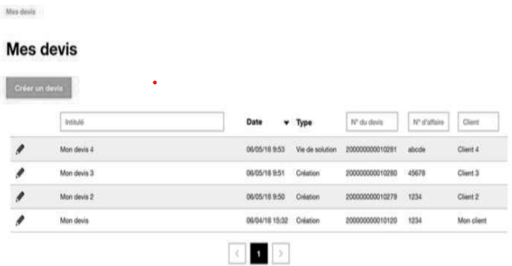

# Evalution UML/DATA

## Jaune# et le projet New Isco

Jaune# est une entreprise française de télécommunication. Elle compte en 2020 près de 259
millions de clients dans le monde, chiffre en hausse par rapport à celui affiché en 2019. En 2020,
l'entreprise est leader ou second opérateur dans trois quarts des pays européens où elle est implantée
et dans plus de 80 % des pays en Afrique et au Moyen-Orient où elle commercialise ses offres. Elle
emploie près de 142 000 personnes, dont 82 000 en France.

**Jaune#** intervient dans de nombreux domaines d’activités tels que la **téléphonie** ou encore **Internet**,
en étant l’un des plus importants Fournisseurs d’Accès à Internet (FAI) au niveau international.
Jaune# est également l’un des leaders mondiaux des services de télécommunications aux
entreprises multinationales sous la marque Jaune# Business Services. 

Ses activités peuvent être regroupées en trois grandes familles :

* les services de communication résidentiels (SCR), c'est-à-dire, la téléphonie fixe, Internet
bas débit (par modem), haut débit (par ADSL) et très haut débit (par la fibre optique), la
téléphonie IP, la visiophonie, la télévision numérique (la TV Jaune#) et les contenus
multimédias (ex : vidéo à la demande) ;

* les services de communication personnels (SCP), c'est-à-dire mobiles ;

* les services de communication d'entreprise (SCE) sous la marque Jaune# Business Services.

Grâce à des infrastructures couvrant la totalité du territoire français, Jaune# accompagne les clients
dans le déploiement de leurs réseaux Haut et Très Haut Débits fixes ou mobiles.

Ces infrastructures comportent entre autres :

De l’ordre de 2 millions d’artères de génie civil souterrain ou aérien ;
- Plus de 15 000 points de présence (Nœuds de Raccordement d’Abonnés – NRA dans le cas de
  boucle locale cuivre et Nœuds de Raccordement Optique – NRO dans le cas de boucle locale
  optique) ;
- Un backbone optique reliant entre eux la quasi-totalité des points de présence

Jaune# donne accès, sous certaines conditions, à ces infrastructures dans le cadre de la régulation
définie par l’Autorité de Régulation des Communications Électroniques et des Postes (ARCEP).

La stratégie actuelle de Jaune# se situe dans la maîtrise, voire la baisse de ses coûts. En effet, face
à une concurrence de plus en plus forte, avec des acteurs qui n’hésitent pas à « casser les prix » des
différents forfaits et offres, Jaune# s’est engagée dans une chasse aux coûts. C’est, selon ses
dirigeants, par la domination des coûts, qu’ils resteront un des leaders du marché. L’entreprise est
donc en pleine restructuration (mobilités fortement recommandées, temps partiel senior, départs à
la retraite non remplacés, suppression de certains sites, benchmark déguisé des salariés, etc.).

Un des nouveaux projets de Jaune# concerne ses vendeurs qui réalisent des devis pour les
professionnels (PME et grands comptes) afin de vendre des solutions d’accès Internet, de
téléphonie fixe, de flotte mobile… Comme ces vendeurs disposent généralement aussi d’un bagage
technique sur les produits qu’ils vendent, ils sont communément qualifiés d’Ingénieur TechnicoCommercial (ITC). À l’heure actuelle, pour pouvoir effectuer des installations chez leurs clients,
les ITC de Jaune# utilisent différentes applications liées les unes aux autres, afin de générer et
configurer un devis jusqu’à la transformation de celui-ci en commande. Un projet de nouvelle
application pour réaliser ces tâches, New Isco, a été validé par la DSI et l’ensemble des acteurs.
Cette nouvelle application devra s’intégrer dans le système d’information (SI) existant et plus
particulièrement dans l’outil de Gestion de la Relation Client (GRC) déjà en place.

## le projet New Isco : présentation

À l’heure actuelle, pour pouvoir effectuer des installations chez leurs clients, les ingénieurs
technico-commerciaux (ITC) de Jaune# utilisent différentes applications liées les unes aux autres,
afin de générer et configurer un devis jusqu’à la transformation de ceux-ci en commandes.
Plusieurs applications sont utilisées à cet effet :

- Eugène permet de saisir et d’importer des devis provenant d’applications externes ;
- Isco permet de gérer certains types d’offres en amont de la saisie des devis ;
- D’autres deviseurs peuvent être aussi utilisés. Un deviseur est une application permettant de créer
  et de gérer des devis. La plupart du temps, ils sont sous forme « d’application » Excel ;
- E-nov permet de gérer des offres packagées, c’est-à-dire des patrons de devis. Cela permet
  d’éviter de devoir faire des devis sur mesure ;
- Gescom transforme le devis en commande. 

Les ITC utilisent, en général, d’abord l’application Isco pour gérer certains types d’offres en amont
de la saisie des devis pour ensuite les exporter dans l’application Eugène et enfin transformer le
devis en commande dans l’application Gescom. 

L’objectif de Jaune# est de décommissionner l’application Eugène, c’est-à-dire arrêter l’utilisation
de l’application et la supprimer du cycle de vie des devis. Ce décommissionnement est motivé par
les gains espérés. De plus, l’application commence à devenir ancienne tant au niveau des
technologies utilisées, que de l’interface utilisateur. 

La DSI de **Jaune#** a effectué une étude sur Isco afin d’effectuer le décommissionnement d’Eugène.
Deux scénarii ont été retenus suite à cette étude : 

- Faire évoluer l’application Isco actuelle ;
- Créer un nouveau module vente New Isco. 

La première solution n’a pas été retenue, car elle engendrerait trop de coûts. En effet, l’application
Isco actuelle utilise des technologies trop anciennes (_PHP et Zend framework version 1
notamment_). C’est ainsi que le projet **New Isco** est né. Il a donc été décidé de développer un tout
nouveau module vente Isco disposant de technologies à jour et évolutif. 

L’avantage de cette nouvelle gestion des devis est que les ITC ne verront pas leurs habitudes
drastiquement changées. En effet, le nouveau module vente New Isco prend en charge les mêmes
fonctionnalités qu’Eugène, en proposant une interface utilisateur plus intuitive et plus actuelle ainsi
qu’une sécurité informatique accrue. Ils pourront continuer à gérer certains types de devis en amont
pour ensuite les importer dans le nouveau module vente New Isco, puis les envoyer à l’application
Gescom pour les transformer en commande. 

L’application **New Isco** devra être conforme aux exigences de sécurité OWASP (Open Web
Application Security Project), qui référence les failles de sécurité des applications Web, fournit des
outils pour tester les applications ainsi que des recommandations pour sécuriser les applications. 

### Travail à faire

1. Proposez un diagramme de classes UML des données de la gestion des devis. 

2. Proposez une implémentation.

3. Proposez un modèle relationnel

4. Écrivez les requêtes SQL répondant aux besoins suivants :

* Nombre de devis de 2020 non transformés en commandes ; 
* Liste des clients (numéro et raison sociale) à qui plus de 5 devis ont été proposés,
  ordonnée sur le nombre de devis décroissant ; 
* ITC (nom, prénom) qui a transformé le plus de devis de 2020 en commandes ;
* Liste des ITC (nom, prénom, nombre de devis) du responsable ITC Paul
  REGENT

## ANNEXE 1: le projet New Isco : Gestion des devis

Chaque ITC peut retrouver la liste de l’ensemble de ses devis :

Le type du devis indique le statut du devis :

● Création : pour création complète du devis ;

● Vie de solution : création à partir d’un devis préexistant ;

● En-cours signature : devis finalisé par l’ITC ou dans le circuit de signature ;

● Refus signature : le devis est à modifier par l’ITC ;

● Signé : le devis a terminé le circuit de signature ;

● Commande : le devis a été transformé en commande.

Le circuit de signature dépend de la catégorie du client, chaque étape de signature doit être effectuée
par un utilisateur, un service (exemple : Service Qualité Client) ou la direction générale. Un refus
de signature doit être accompagné d’un commentaire attaché au devis. À chaque étape du circuit
est mémorisée l’accord ou le refus ainsi que la date et l’utilisateur signataire.

Suite à la création, il est possible d’accéder à l’interlocuteur chez le client. L'interlocuteur principal
est proposé, l’ITC peut en créer un autre ou en choisir un autre interlocuteur attaché au client.
L’ITC ajoute ensuite à son devis des articles matériels et/ou des prestations de service. 

Ces
prestations seront réalisées par un prestataire extérieur ou un intervenant interne. 

Dans cette première version, le prix de vente est calculé à partir du prix de revient de l’article et du
coefficient de vente présent sur celui-ci. Une évolution de ce calcul est prévue : chaque client peut
avoir un coefficient particulier par famille d’article, par fournisseur. Le coefficient le plus
intéressant est proposé lors du rattachement de l’article au devis. Cette proposition de coefficient
peut être modifiée par l’ITC.
Les prestations de service sont traitées de la même manière que les articles matériels

